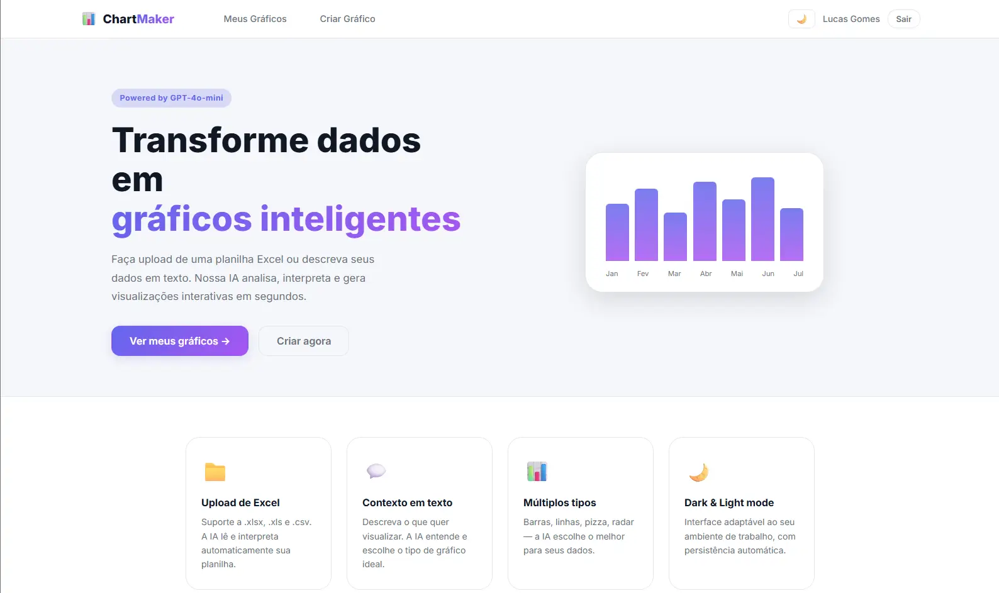
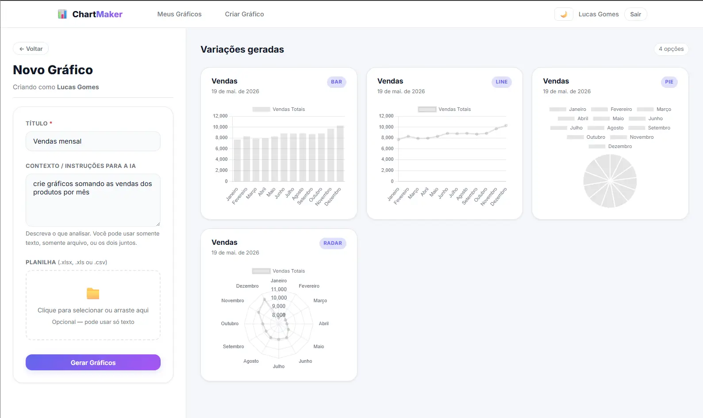

# 📊 ChartMaker

ChartMaker is an AI-powered platform that transforms raw data into meaningful charts and visualizations.

Users can upload spreadsheets or provide data through text, and the application automatically analyzes, structures, and interprets the information using Large Language Models (LLMs). Based on the detected patterns, the platform generates the most suitable chart, making data visualization faster and more accessible.

## 🚀 Features

- Upload spreadsheets or paste raw data
- AI-powered data interpretation and structuring
- Automatic chart generation
- Interactive and dynamic visualizations
- Multiple chart types support
- User-friendly interface

## 🛠️ Tech Stack

- React
- TypeScript
- .NET
- PostgreSQL
- OpenAI API
- Docker

## 📸 Screenshots

### Landing Page

### Generated Charts

## 🎯 Project Goal

The goal of ChartMaker is to simplify data analysis by allowing users to transform raw data into professional visualizations without manually configuring charts or performing complex data transformations.
